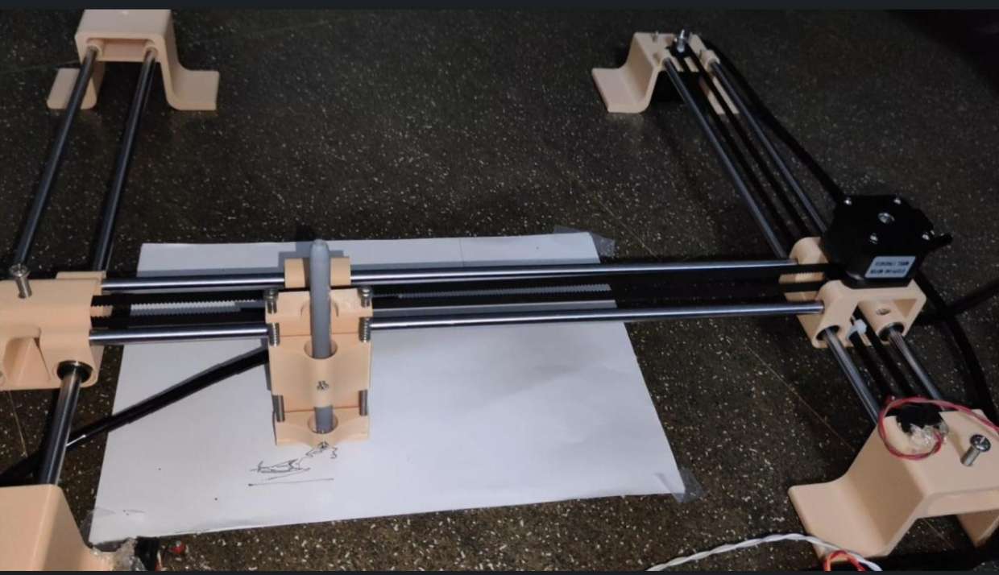
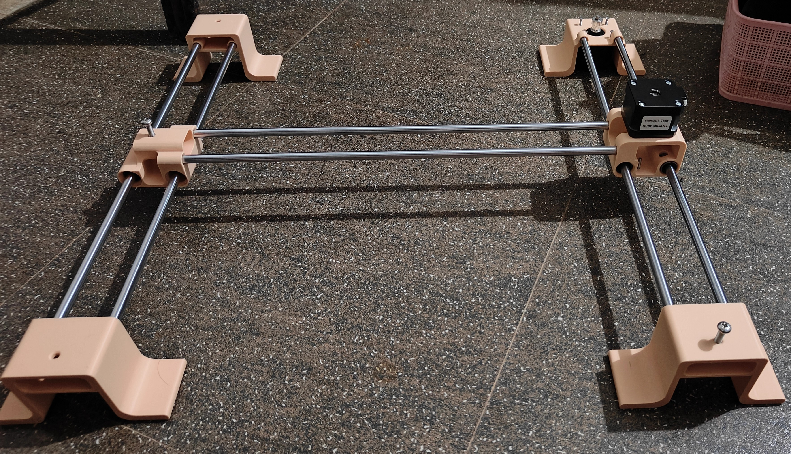
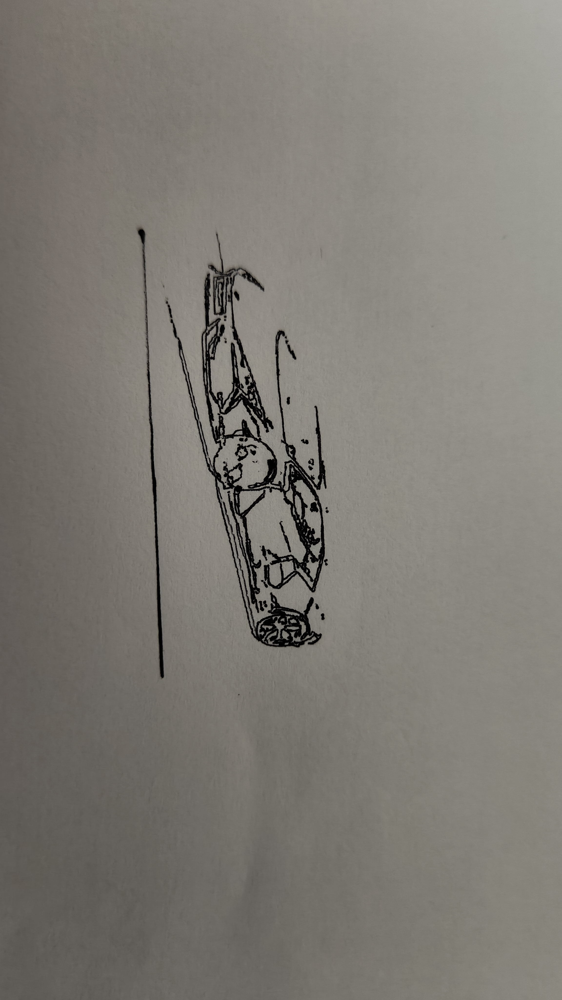

# ✒️ CNC Pen Plotter — GRBL Firmware (Custom Homing)

A DIY CNC pen plotter built on an **Arduino Uno + CNC Shield**, running a fork of the [grbl/grbl](https://github.com/grbl/grbl) firmware with a **custom Y-first homing sequence**.

---

## 📸 Gallery

<p align="center">
  
</p>
<p align="center">
  
</p>
<p align="center">
  
</p>
<p align="center">
  
</p>


---

## 🧰 Hardware

| Component | Details |
|-----------|---------|
| Microcontroller | Arduino Uno |
| Motion controller | CNC Shield v3 |
| Stepper drivers | DRV8825 (×2) |
| Steppers | NEMA 17 (X and Y axes) |
| Pen lift | Servo motor |
| Frame | 3D printed and smooth rods of 300mm |
| Power supply | DC 12V 5A |
| Limit switches | 2× microswitches (X-min, Y-min) |

---

## 💾 Firmware

**Base:** [grbl/grbl](https://github.com/grbl/grbl) — the original open-source CNC firmware for Arduino.

**Modified file:** `grbl/config.h`

### 🔧 Custom Homing Sequence

The default GRBL homing order is X → Y. For this plotter the **Y axis is homed first** to avoid mechanical conflicts during the homing stroke.

The following lines were **added by me** to `grbl/config.h` to suit my specific plotter geometry. These are not part of the original GRBL source:

```c
// --- CUSTOM HOMING SEQUENCE (added for this build) ---
// Overrides the default GRBL homing order (X first) to home Y first.
// This suits my plotter's geometry — remove or adjust if yours differs.

#define HOMING_CYCLE_0 (1<<Y_AXIS)   // Step 0 — Home Y first
#define HOMING_CYCLE_1 (1<<X_AXIS)   // Step 1 — Then home X

// Z axis (pen lift) is NOT included in the homing cycle.
// #define HOMING_CYCLE_2 (1<<Z_AXIS) // Uncomment if you add a Z limit switch
```

> **Why Y first?**  
> On this plotter the X carriage rides on the Y gantry. Homing Y first parks the gantry safely before the X carriage moves to its home position, preventing the pen from dragging across the work surface.

---

## ⚙️ GRBL Configuration (`$$` settings)

Connect via a serial monitor (115200 baud) and apply these recommended starting values:

```
$0=20
$1=25
$2=0
$3=0
$4=0
$5=0
$6=0
$10=2
$11=0.010
$12=0.002
$13=0
$20=0
$21=0
$22=1
$23=3
$24=150.000
$25=800.000
$26=250
$27=4.000
$100=208.333
$101=208.333
$102=100.000
$110=400.000
$111=600.000
$112=500.000
$120=20.000
$121=20.000
$122=5.000
$130=200.000
$131=200.000
$132=200.000
```

---

## 🔌 Wiring Overview

```
Arduino Uno
  └── CNC Shield v3
        ├── X driver  → X stepper (left-right axis)
        ├── Y driver  → Y stepper (front-back / gantry axis)
        ├── Z driver  → Z stepper or servo (pen lift)
        ├── X-min pin → limit switch (X home)
        └── Y-min pin → limit switch (Y home)

Power:
  12 V PSU → CNC shield VIN/GND terminals
  USB      → Arduino (for serial/flashing only — do NOT power steppers via USB)
```

> 📷 _Add your wiring diagram photo here:_

<p align="center">
  
</p>

---

## 🚀 Getting Started

### 1 — Flash the firmware

```bash
# Clone this repo
git clone https://github.com/YOUR_USERNAME/YOUR_REPO.git
cd YOUR_REPO

# Open in Arduino IDE
# Board   : Arduino Uno
# Port    : COMx / /dev/ttyUSBx
# Sketch  : grbl/examples/grblUpload/grblUpload.ino
# Upload  ✔
```

### 2 — Connect & configure

Open Arduino IDE Serial Monitor (or any G-code sender) at **115 200 baud**.

```
$$          ; view current settings
$22=1       ; enable homing
$21=1       ; enable hard limits
$H          ; run homing cycle (Y homes first, then X)
```

### 3 — Run a plot

Use any G-code sender that supports GRBL:

- **Universal Gcode Sender (UGS)** — recommended
- Candle
- bCNC

Generate G-code from SVG with **Inkscape 0.92** using the extension from [CodersCafeTech/Large-CNC-Plotter](https://github.com/CodersCafeTech/Large-CNC-Plotter).

---

## 📁 Repository Structure

```
.
├── grbl/                  # Modified GRBL source
│   ├── config.h           # ← Custom homing sequence lives here
│   └── ...
├── images/                # Your photos go here
│   ├── machine-front.jpg
│   ├── machine-side.jpg
│   ├── arduino-cnc-shield.jpg
│   ├── pen-carriage.jpg
│   ├── wiring-diagram.jpg
│   └── first-plot.jpg
├── gcode/                 # Example G-code files
│   └── test-square.nc
└── README.md
```

---

## 🐛 Troubleshooting

| Symptom | Likely cause | Fix |
|---------|-------------|-----|
| Axes move in wrong direction during homing | Direction invert bits wrong | Flip `$3` bits or physically swap stepper wires |
| Machine doesn't stop at limit switch | Limit switches not wired / `$21=0` | Check wiring; set `$21=1` |
| Homing alarm immediately on `$H` | Limit switch already triggered at startup | Set `$5=1` if using NC switches |
| Steps/mm wrong (circles are oval) | `$100`/`$101` not calibrated | Measure a known distance, calculate: `steps_mm = steps_per_rev × microsteps / mm_per_rev` |
| Pen drags on retract | Z not configured | Tune `$102`, `$112`, `$122` |

---

## 📄 License

The GRBL firmware is licensed under the **GNU GPLv3** — see [grbl/grbl LICENSE](https://github.com/grbl/grbl/blob/master/LICENSE).  
All modifications in this repository are released under the same GPLv3 license.

---

## 🙏 Credits

- [grbl/grbl](https://github.com/grbl/grbl) — Sungeun K. Jeon and the GRBL contributors
- [CodersCafeTech/Large-CNC-Plotter](https://github.com/CodersCafeTech/Large-CNC-Plotter) — Inkscape extension for G-code generation
- [Inkscape 0.92](https://inkscape.org/) — SVG editor used to prepare artwork
- Arduino & CNC Shield community

---

_Built with ✒️ and patience._
